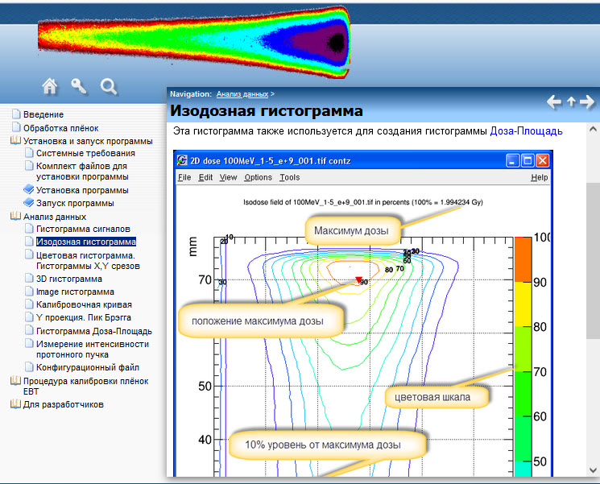
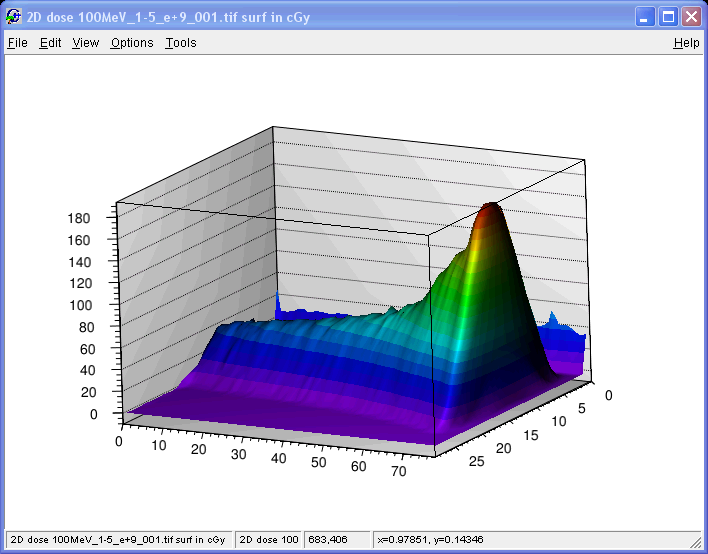

Программа предназначена для обработки данных полученных с помощью дозиметрических плёнок EBT2/EBT3 
http://www.gafchromic.com/gafchromic-film/radiotherapy-films/EBT/index.asp

 
После облучения дозиметрической плёнки она сканируется, в результате получается файл с расширением .tif
Он является входным файлом программы. Степень потемнения определённой области плёнки соответствует поглощённой дозе.

 
Программа позволяет проводить анализ дозных полей полученных после облучения их протонным пучком.

В основе программы лежит система ROOT http://root.cern.ch,
которая используется для построения гистограмм дозных распределений и предоставляет математический аппарат для их анализа.

Подобное описание https://x2v0.github.io/EBTfilm/

