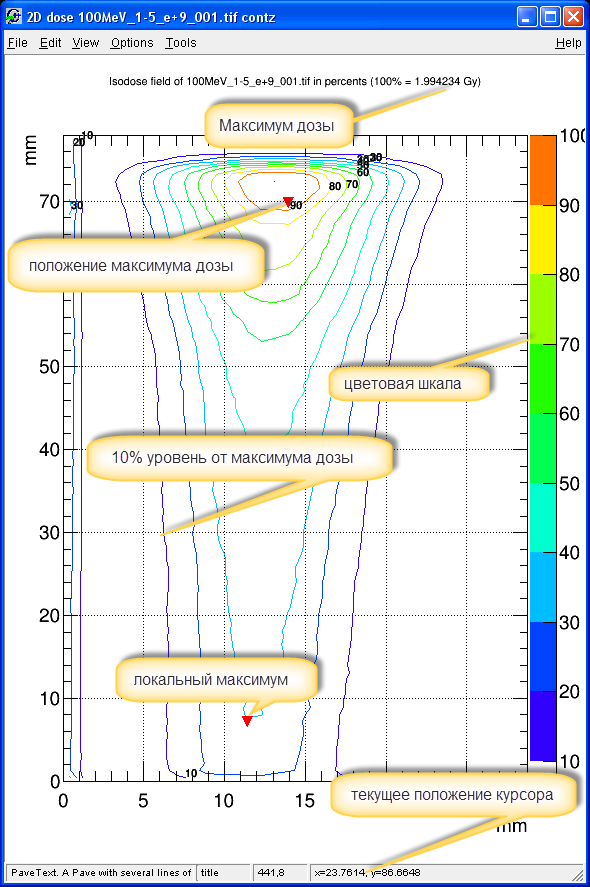

Программа предназначена для обработки данных полученных с дозиметрических плёнок EBT2/EBT3 
http://www.gafchromic.com/gafchromic-film/radiotherapy-films/EBT/index.asp

 
После облучения дозиметрической плёнки, она сканируется сканером, в результате получается файл с расширением .tff
Он является входным файлом программы. Степень потемнения определённой области плёнки отображает поглощённую в ней дозу.

 
Программа позволяет проводить анализ дозных полей полученных после облучения их протонным пучком..

В основе программы лежит система ROOT (http://root.cern.ch), 
которая позволяет строить различные гистограммы дозных распределений и предоставляет математический аппарат для их анализа.

Подобное описание https://x2v0.github.io/EBTfilm/

